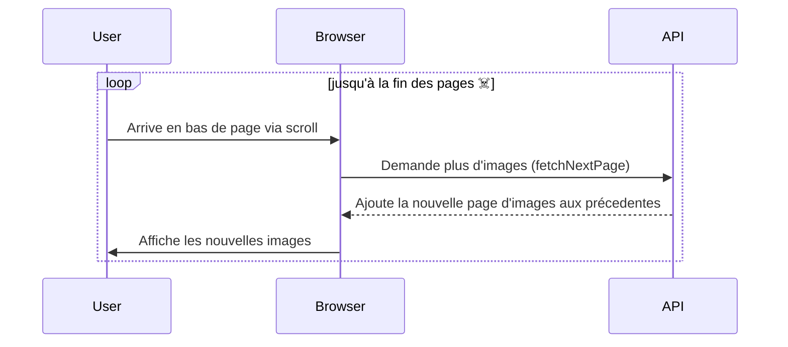

Dans cet article je vais vous montrer comment créer un composant d'infinite scroll en React. Le rendu de listes pouvant "charger plus" de données de manière additive est un modèle d'interface très courant, devenu même fondamental dans les réseaux sociaux. Aujourd'hui, je vous guide étape par étape pour l'implémenter dans vos propres projets, en utilisant **TanStack Query** (FKA React Query) sous React. 🎩✨

Alors, préparez votre IDE et vos molettes de souris, ça va doomscroller !

## Qu'est-ce que l'infinite scroll ? 🤔

L'infinite scroll est une technique d'UX qui permet de charger plus de contenu de manière dynamique lorsque l'utilisateur atteint le bas de la page. Plutôt que d'avoir des boutons "Page suivante" ou "Voir plus", le contenu s'affiche automatiquement. Cela crée une expérience utilisateur fluide et immersive.

## Exemple d'utilisation :

Prenons par exemple une galerie d'images qui affiche les premiers résultats, puis va  charger au fur et à mesure les résultats suivant.
Voici un diagramme de séquence simple pour décomposer le principe utilisateur :



Pour faire cet article je vais utiliser la très bonne API [The Cat API](https://thecatapi.com/). Comme vous l'aurez compris ici, cats run the world ! J'affiche une page sur une race de chat dans laquelle se trouve une gallerie d'images. C'est sur cette dernière que je souhaite mettre en place mon doom cat scroll. ☠️🐱

Voici le résultat :


## Le Plan de Bataille 🛠️

Voici ce que nous allons faire :
1. Configurer les appels API avec `react-query` pour gérer les appels d'API de manière paginée et efficace
2. Créer un composant `InfiniteScrollImages` qui gérera le rendu des images selon l'événement de scroll
3. Effectuer les appels serveurs et instancier le composant dans le parent

### Le Code : Décomposons Tout Cela 📜

### 1. Les API Call avec `react-query`

Commençons d'abord pas mettre en place la partie permettant de gérer les appels API. Il est préférable de commencer par cette partie car c'est elle qui va structurer le composant. Après un peu de veille, c'est le choix de la librairie **TanStack Query** (FKA React Query) qui s'impose rapidement. Cette librairie populaire de data fetching nous facilite grandement l'affaire puisqu'elle dispose une version de `useQuery`, appelée `useInfiniteQuery`, qui permet de gérer les appels aux requêtes paginées des API. A cette date, j'utilise la dernière version de la librairie (5.59.0). Voyons cela en détail sur notre Cat API.
Analysons notre API. Voici la requête pour fetch mes images de chats par race en utilisant `Axios` pour les appels :

```javascript
const response = await axios.get(`${process.env.REACT_APP_BASE_API_URL}/images/search`, {
    params: {
        breed_ids: breedId,
        page: pageParam,
        limit: limit,
        order: order,
    },
    headers: {
        "x-api-key": process.env.REACT_APP_CAT_API_KEY,
    },
});
```

Le numéro de page est donc situé dans les params de la requête. L'objectif est de laisser la fonction `useInfiniteQuery` gérer le passage à la page suivante pour charger les résultats. Pour rendre l'appel paramètrable, il va falloir wrapper tout cela dans une fonction contenant les différents paramètres de l'appel à l'API, à l'exception du numéro de page, géré par React Query.

```javascript
export const useFetchInfiniteImagesByBreed = (breedId, limit = 4, order = 'ASC') => {
    const fetchBreedImageById = async ({ pageParam = 0, queryKey }) => {
        const [_, breedId, limit, order] = queryKey; // Récupére les paramètres de la clé de requête

        const response = await axios.get(`${process.env.REACT_APP_BASE_API_URL}/images/search`, {
            params: {
                breed_ids: breedId,
                page: pageParam,
                limit: limit,
                order: order,
            },
            headers: {
                "x-api-key": process.env.REACT_APP_CAT_API_KEY,
            },
        });
        return response.data;
    };


    return useInfiniteQuery({
        queryKey: ['imagesByBreed', breedId, limit, order],
        queryFn: fetchBreedImageById,
        initialPageParam: 0,
        getNextPageParam: (lastPage, pages) => {
            const nextPage = pages.length;
            return lastPage.length === limit ? nextPage : undefined;
        },
    });
};
```
Disséquons ce code en commençant par l'utilisation du `useInfiniteQuery`. Il a besoin pour fonctionner d'un objet constitué de :
 - La `queryFn` qui contient la ***référence*** à la query.
 - `initialPageParam` est la page qui sera chargée en premier. Il est optionel et par défaut à 0.
 - La `initialPageParam` est l'identifiant de la requête. Cela permet notamment à TanStack de gérer la mise en cache des requête. Il sert, en plus, ici, à passer les différents params de la fonction passée en référence dans la `queryFn`.
 - `getNextPageParam` est une fonction qui permet à la "infinite query" de savoir comment aller à la page suivante. Notre Cat API n'est malheureusement pas implémentée en modèle ***HATEOAS*** et ne contient donc pas de liens de navigations; ce qui nous aurait simplifié les choses. Pour contourner le problème, la fonction renvoit la page suivante est demandée si les derniers résultats obtenus sont du nombre de ceux demandés (`limit`). Sinon cela signifie que l'on est arrivé au bout des résultats.

### 2. Création du composant `InfiniteScrollImages` pour gérer le rendu des images

Voyons maintenant la création du composant réutilisable `InfiniteScrollImages`. Ce composant est responsable de l'affichage des images et de l'écoute des événements de scroll pour savoir quand charger les prochaines pages d'images.

```javascript
const InfiniteScrollImages = ({ data, fetchNextPage, hasNextPage, isFetchingNextPage }) => {

    useEffect(() => {
        const handleScroll = () => {
            const { scrollTop, clientHeight, scrollHeight } = document.documentElement;
            const isNearBottom = scrollTop + clientHeight >= scrollHeight - 20;
            if (hasNextPage && !isFetchingNextPage && isNearBottom) {
                fetchNextPage();
            }
        };

        window.addEventListener("scroll", handleScroll);
        return () => {
            window.removeEventListener("scroll", handleScroll);
        };
    }, [fetchNextPage, hasNextPage, isFetchingNextPage ]);

    return (
        <>
            <ImagesContainer>
                {data?.pages.map((page) => (
                    page.map((image) => (
                        <CatBreedImage key={image.id} src={image.url} alt="Cat" />
                    ))
                ))}
            </ImagesContainer>

            {isFetchingNextPage && hasNextPage && (
                <LoaderContainer>
                    <Loader />
                </LoaderContainer>
            )}
        </>
    );
};

export default InfiniteScrollImages;
```

Le hook `useEffect` contient la logique d'infinite scroll. L'idée est d'écouter l'événement de scroll et de vérifier dans la fonction de callback, si l'utilisateur est proche du bas du défilement de la page pour appeler la fonction de fetch de la page suivante.
Lorsque le composant est démonté, on s'assure de supprimer le listener pour éviter les fuites de mémoire.
Il ne reste plus qu'à parcourir `data` pour afficher les images présentent dans chaque page. Un loader s'affiche lorsqu'une nouvelle requête est envoyée à l'API. Un peu de CSS pour gérer l'affichage, rendre tout cela responsive et le tour est joué !

### 3. Intégration finale

Enfin, il ne reste plus qu'à appeler ce composant dans votre page principale parente :

```javascript
const {
    data,
    fetchNextPage,
    hasNextPage,
    isFetchingNextPage,
} = useFetchInfiniteImagesByBreed(breed.id, 8, 'ASC');

return (
    <DetailsContainer>
            [...]
        <GalleryWrapper>
            <GalleryTitle>Gallery :</GalleryTitle>
            <ImagesContainer>
                <InfiniteScrollImages
                    data={data}
                    fetchNextPage={fetchNextPage}
                    hasNextPage={hasNextPage}
                    isFetchingNextPage={isFetchingNextPage}/>
            </ImagesContainer>
        </GalleryWrapper>
    </DetailsContainer>
);
```

## Conclusion 🎉

Et voilà, vous avez maintenant un composant InfiniteScrollImages qui charge des images de manière dynamique au fur et à mesure que l'utilisateur fait défiler la page ! L'infinite scroll est une fonctionnalité puissante pour enrichir l'expérience utilisateur. Grâce à react-query (souvent déjà intégré dans les projets React), son implémentation est simplifiée tout en optimisant la gestion des appels API côté client.